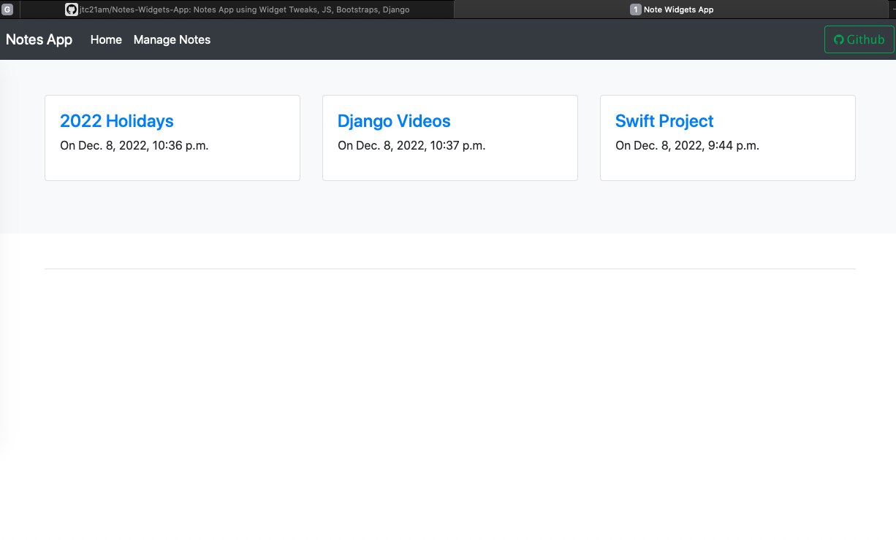
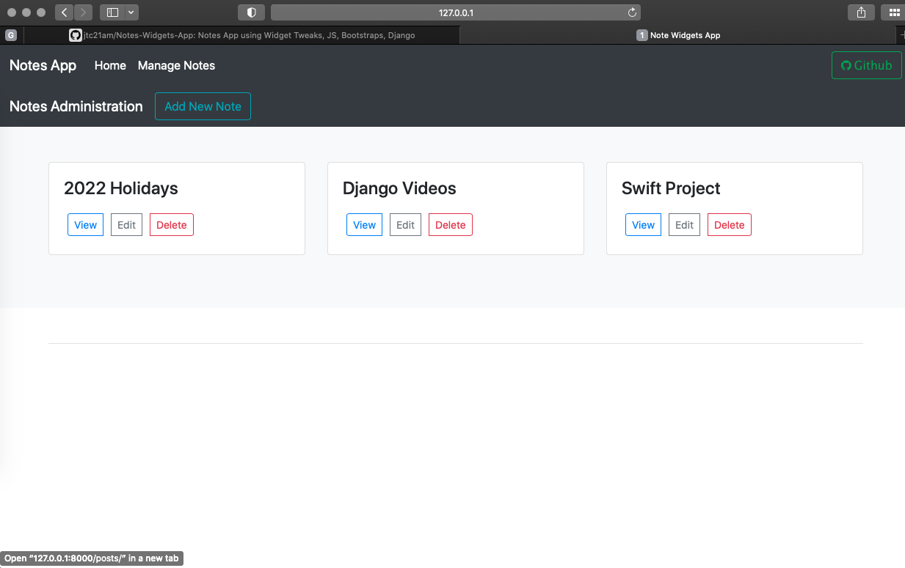
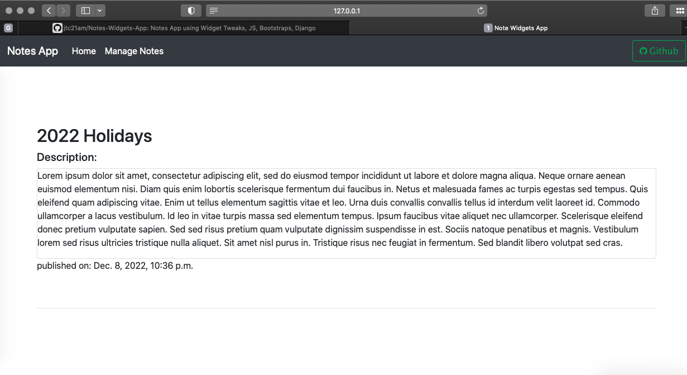
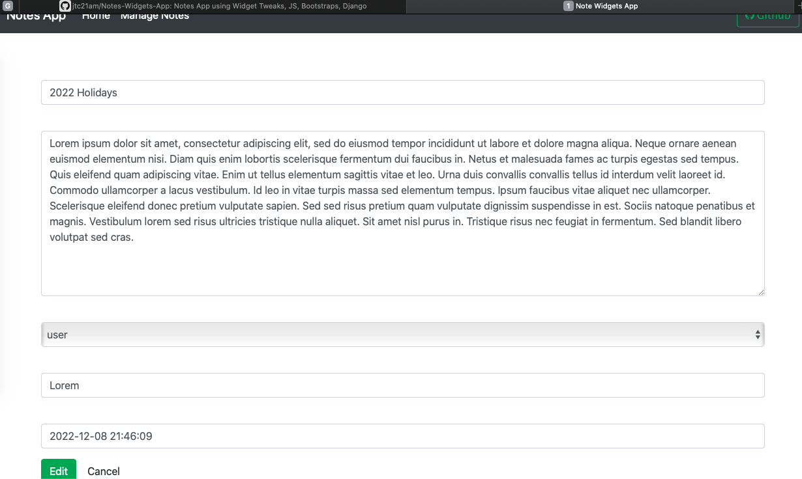
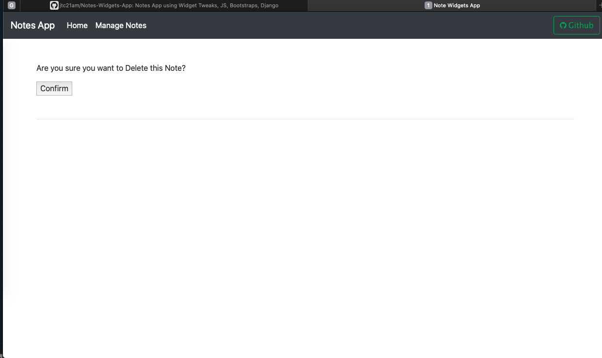

# Notes-Widgets-App
Notes App using Widget Tweaks, JS, Bootstraps, Django, SLUGS

This repo uses Django Class Base Views

## Running the Project Locally

First, clone the repository to your local machine:

## Install Requirements:

pip install -r requirements.txt
pip install django-widget-tweaks

## Apply the migrations:

python manage.py migrate
## Create Superuser:

python manage.py createsuperuser

Add Your Name, Email & Password.

## Finally, run the development server:

python manage.py runserver

The project will be available at **http://127.0.0.1:8000/**.

